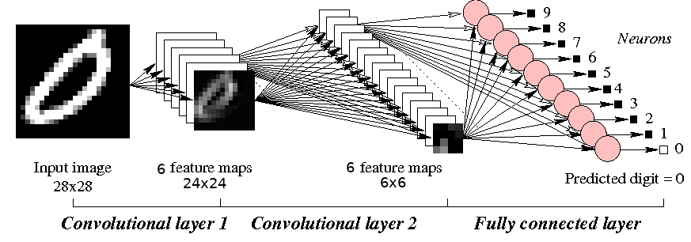
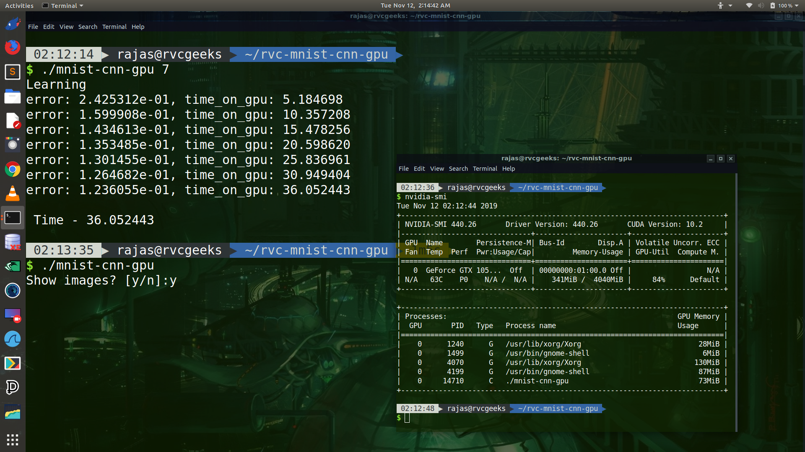
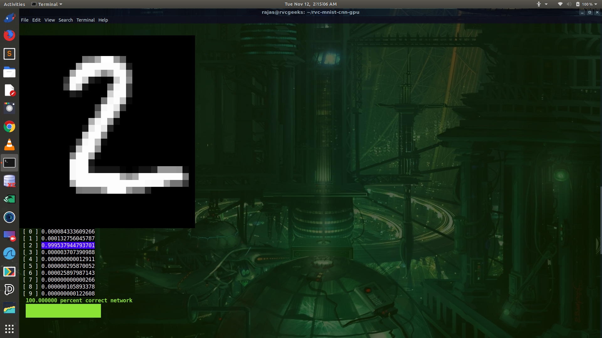

# Rvc MNIST classifier in CUDA

A MNIST handwritten digit classifier written from scratch in Cuda - C



## Getting Started

These instructions will get you a copy of the project up and running on your local machine for development and testing purposes. See deployment for notes on how to deploy the project on a live system.

### Prerequisites

This project is built on Ubuntu 18.04 LTS with
nvidia-cuda-toolkit having NVIDIA GeForce 1050 Ti (4 GB) Acer Nitro 5 laptop
For its compilation you need:

1) a good linux OS supporting NVIDIA GPU.
2) nvidia-cuda-toolkit 

### Compilation

It has a Makefile script in src directory so in terminal so just run

```
make
```
This will create a 'mnist-cnn-gpu' binary.

## Deployment

run
```
./mnist-cnn-gpu [max iter]
```
with 'max iter' as no. of iterations of learning to perform over the dataset,
and with no arguments for testing. A ready made model is kept in the repository
keep it aside of binary to load trained weights if you want.

## Author

* **Rajas Chavadekar** 

## License

This project is licensed under the MIT License - see the [LICENSE](LICENSE) file for details

### Training 


### Classification


### Testing

